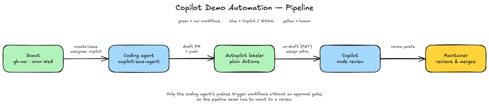

# Agentic Workflows: Copilot Demo Automation

> How the repository turns newly shipped GitHub Copilot features into demo-site guides
> automatically — and the hard-won rules for building **GitHub Agentic Workflows (gh-aw)** that
> collaborate with the Copilot coding agent without a human clicking "Approve and run".

Use this as the reference when creating or changing any agentic workflow in this repo.

## Table of Contents

- [Overview](#overview)
- [Architecture](#architecture)
- [Workflow Inventory](#workflow-inventory)
- [End-to-End Flow](#end-to-end-flow)
- [Key Mechanisms & Gotchas](#key-mechanisms--gotchas)
- [Design Decisions & Trade-offs](#design-decisions--trade-offs)
- [Setup / Reproduction Checklist](#setup--reproduction-checklist)
- [Troubleshooting](#troubleshooting)
- [Files & Where Things Live](#files--where-things-live)
- [Lessons for Future Agentic Workflows](#lessons-for-future-agentic-workflows)

---

## Overview

Every Wednesday a scheduled agent scans the GitHub Changelog `copilot` tag, decides which new
features are worth a **hands-on demo**, and delegates building each one to the **Copilot coding
agent**. From there it's trigger-based and hands-off: the demo PR is auto-labeled, un-drafted the
moment the agent finishes, assigned to the maintainer, and reviewed by Copilot code review — the
maintainer just reviews and merges.

---

## Architecture



The single most important property: **only the coding agent's _pushes_ trigger workflows without an
approval gate.** Everything in the automated path is reachable from a push; anything that would have
to react to a _review_ is not.

---

## Workflow Inventory

| Workflow | File | Kind | Trigger | Purpose |
|---|---|---|---|---|
| **Demo Scout** | `.github/workflows/copilot-demo-scout.md` (+`.lock.yml`) | gh-aw (engine `copilot`, model `claude-sonnet-4.5`) | `schedule: "0 8 * * 3"` + `workflow_dispatch` | Scan changelog, judge demo-fit, file a build brief per feature and delegate to the coding agent. |
| **Demo PR Autopilot** | `.github/workflows/copilot-demo-label.yml` | plain GitHub Actions | `pull_request` `[opened, reopened, edited, synchronize, review_requested]` | Label the PR, wait for the agent to finish, un-draft it, and assign the maintainer. |

---

## End-to-End Flow

1. **Scout runs** (Wed, or `gh workflow run copilot-demo-scout.lock.yml`): fetches the changelog RSS,
   keeps items from the last 14 days, judges demo-fit, and files `create-issue` briefs (`max: 3`,
   `deduplicate-by-title`, labels `demo-candidate, automated-demo`) **assigned to `copilot`**. Each
   brief tells the agent to add `demo-site/src/content/docs/demos/NN-slug.mdx`, follow the existing
   demos, **run Prettier**, and put `Fixes #<issue>` in the PR body.
2. **The coding agent builds** on a `copilot/…` branch and opens a **draft** PR — firing
   `copilot_work_started`, then `copilot_work_finished` (and dropping `[WIP]`) when done.
3. **The autopilot labeler fires on the agent's push** (ungated): confirms the agent is the author,
   labels the PR, then **polls the timeline** until the newest `copilot_work_*` event is
   `copilot_work_finished`.
4. **It un-drafts the PR** (`gh pr ready`, user PAT) and **assigns `edinc`**.
5. **Copilot code review runs automatically** (repo ruleset auto-requests it on ready PRs).
6. **The maintainer** is notified as assignee when the review posts, and reviews / merges (or re-runs
   the agent).

---

## Key Mechanisms & Gotchas

| Topic | What to know |
|---|---|
| **The approval gate (biggest gotcha)** | By default GitHub holds *every* workflow on a coding-agent PR for manual approval (`action_required`). Turn it off at repo **Settings → Copilot → Cloud agent → "Require approval for workflow runs" = OFF** (keep **"Allow automations" = ON**) — repo-admin only, and separate from the fork / Actions-General settings. |
| **Only _pushes_ are ungated, not _reviews_** | Disabling that gate ungates workflows triggered by the agent's **pushes**, not **reviews**: `pull_request_review` stays gated, and a commit pushed by your own workflow counts as "an automation" that won't trigger further runs. So a review-timed action needs a scheduled poller or a click — here the human hand-off is an assignment at un-draft time instead. |
| **Delegating to the coding agent** | Assign an issue/PR to the bot `copilot-swe-agent` (node id `BOT_kgDOC9w8XQ`). gh-aw does this with `create-issue { assignees: [copilot] }`; to do it by hand use the GraphQL `replaceActorsForAssignable` mutation. |
| **You need a user PAT, not `GITHUB_TOKEN`** | The default Actions `GITHUB_TOKEN` **cannot trigger the coding agent** and **cannot `markPullRequestReadyForReview`** ("Resource not accessible by integration"). Store a user PAT as the secret **`GH_AW_AGENT_TOKEN`** and use it for delegation _and_ for `gh pr ready`. |
| **"Agent is done" signal** | The PR timeline carries `copilot_work_started` / `copilot_work_finished` events. The agent is finished when the **newest** `copilot_work_*` event is `copilot_work_finished`. Don't rely on the `[WIP]` title alone. |
| **The done-event can lag the push** | `copilot_work_finished` can be recorded a few seconds after the push/rename that triggers your workflow. The autopilot **polls** the timeline briefly (and also triggers on `review_requested`, which fires at finish) so it never un-drafts mid-build. |
| **`pull_request` uses the PR _head_ branch's workflow** | A `pull_request`-triggered workflow runs the version of the workflow file on the **PR branch**, not `main`. Commit workflow changes to `main` **before** the agent branches a new PR, or they won't apply to in-flight PRs. |
| **CI gates tests behind lint** | `ci.yml`'s `Build & Test` job has `needs: lint`. The `Lint & Format` job runs `prettier --check .`. If the agent emits an unformatted file, lint fails → **all test jobs are skipped** → the summary shows "Total tests: 0". Fix: the scout brief **requires the agent to `prettier --write`** its output. |
| **Canonical repo & redirects** | The repo is org-owned as `codecurrent-sandbox/octo-eshop-demo`; `edinc/octo-eshop-demo` redirects. `GET` follows redirects, but **`POST`/`PUT`/`gh workflow run` do not** — always pass `-R codecurrent-sandbox/octo-eshop-demo` for writes. |
| **gh-aw compile model** | The markdown **body is read from the `.md` at runtime**; the compiled `.lock.yml` stores content hashes (a `frontmatter_hash` + `body_hash`) in its metadata header, not the body text. After editing a `.md`, run `gh aw compile <name>` and **commit both** the `.md` and `.lock.yml` (an "activation" step checks the lock matches). |
| **Concurrency cancellations are normal** | With `cancel-in-progress: false`, when several PR events queue in the same concurrency group GitHub keeps the in-progress run + the latest pending one and **cancels intermediate pending runs**. Those `cancelled` entries are expected; the completing run still does the work (steps are idempotent). |
| **Bot login is inconsistent** | The agent's author appears as `app/copilot-swe-agent` via the API but differently in raw webhook payloads. Scope by resolving the author with `gh pr view --json author` and matching loosely (`*copilot*`/`*swe-agent*`) rather than an exact `if:` on `pull_request.user.login`. |
| **Draft PRs aren't reviewed** | The ruleset has `review_draft_pull_requests: false`, so Copilot won't review a draft. Un-drafting is what kicks off review — hence the autopilot's core job. |

---

## Design Decisions & Trade-offs

- **Human review after Copilot's review.** Reacting to a review automatically is gated (see the
  gotchas above), so the pipeline hands the reviewed PR to a human. The agent self-reviews during its
  build (repo "validation tools" setting), so demos arrive fairly clean.
- **Hand-off = assignment, not a comment.** Assigning `edinc` at un-draft time makes GitHub notify
  them when the review posts — so "findings are in" needs no gated review-trigger. (A review-timed
  _comment_ would need a poller or a click.)
- **Scout is the only schedule;** everything after is trigger-based. A review-timed action is the one
  thing that can't be a no-click trigger — schedule-or-click by nature.
- **Engine model pinned to `claude-sonnet-4.5`.** Other models 400'd on this subscription; Copilot
  Opus 4.8 isn't available to any GitHub cloud agent (coding-agent picker caps at Opus 4.7).

---

## Setup / Reproduction Checklist

Repo admin, one-time:

- [ ] **Secret `GH_AW_AGENT_TOKEN`** — a user PAT (Copilot-licensed) with `repo` scope. Used to
      delegate to the coding agent and to un-draft PRs.
- [ ] **Copilot → Cloud agent → "Require approval for workflow runs" = OFF**, **"Allow automations" =
      ON** (repo Settings, on the canonical repo).
- [ ] **Copilot coding agent** enabled; **Copilot code review** auto-requested via a branch ruleset on
      the default branch (with `review_draft_pull_requests` left `false`).
- [ ] **Labels** `demo-candidate` and `automated-demo` exist (the labeler force-creates
      `automated-demo` if missing).
- [ ] **Actions** permitted to create PRs / run.
- [ ] Local tooling: `gh extension install github/gh-aw`; `gh auth refresh -s read:org`.

Author / change a workflow:

- [ ] Edit the `.md`, run `gh aw compile <name>`, commit **both** `.md` and `.lock.yml`.
- [ ] For `pull_request`-triggered plain-Actions workflows, remember the PR-head-branch rule.

---

## Troubleshooting

| Symptom | Cause | Fix |
|---|---|---|
| CI comment: **"Some tests failed / Total tests: 0"** | `Lint & Format` (Prettier) failed on an agent file; `Build & Test` (`needs: lint`) was **skipped**. | Ensure the agent formats its output (`prettier --write`). Confirm in the run: `Build & Test` shows `skipped`, `Lint & Format` shows `failure`. |
| Workflow stuck at **`action_required`** | The Copilot approval gate. | Turn OFF "Require approval for workflow runs" (repo → Copilot → Cloud agent). Note review-triggered workflows stay gated regardless. |
| PR built but **never un-drafts** | Either `gh pr ready` used `GITHUB_TOKEN` (403 `markPullRequestReadyForReview`), or the done-signal wasn't seen. | Use `GH_AW_AGENT_TOKEN`; confirm the timeline shows `copilot_work_finished`. |
| Scout runs but **creates no issues** | `deduplicate-by-title` matched an existing (even closed) issue, or nothing in the 14-day window was demoable (a `[aw] No-Op Runs` issue is filed). | Expected steady-state; seed a demo manually by creating an issue and assigning `copilot-swe-agent` if you need to test downstream. |
| `gh workflow run` / API write hits the wrong repo | Redirect from `edinc/…` isn't followed for writes. | Always `-R codecurrent-sandbox/octo-eshop-demo`. |
| Workflow change didn't take effect on an existing PR | `pull_request` uses the PR-branch copy of the workflow. | Land the change on `main` before new PRs branch; or update the existing PR's branch. |

---

## Files & Where Things Live

```
.github/workflows/
  copilot-demo-scout.md        # gh-aw scout (source of truth)
  copilot-demo-scout.lock.yml  # compiled — commit alongside the .md
  copilot-demo-label.yml       # plain-Actions "Demo PR autopilot"
.github/aw/
  actions-lock.json            # gh-aw action pins (tracked)
  logs/                        # gh-aw run logs (gitignored)
docs/
  agentic-workflows.md         # this document
```

---

## Lessons for Future Agentic Workflows

1. **Classify your trigger.** On a coding-agent PR, ask "does this react to a _push_ or to a
   _review_?" Push-triggered can be no-click; review-triggered cannot.
2. **Prefer plain deterministic Actions** for mechanical steps (labeling, un-drafting, assigning).
   Reserve the AI engine (gh-aw) for genuine judgement (the scout's demo-fit decision).
3. **Use the timeline, not titles, for lifecycle state** (`copilot_work_finished`).
4. **Give the workflow the right token.** The Actions `GITHUB_TOKEN` can't trigger the agent or
   un-draft; a user PAT can.
5. **Make the agent satisfy your CI**, don't fight it downstream — e.g. tell it to run the formatter,
   rather than reformatting after the fact.
6. **A review-completion action is schedule-or-click.** Decide up front whether that's worth a poller,
   a click, or (as here) leaning on GitHub's native assignee notifications.
