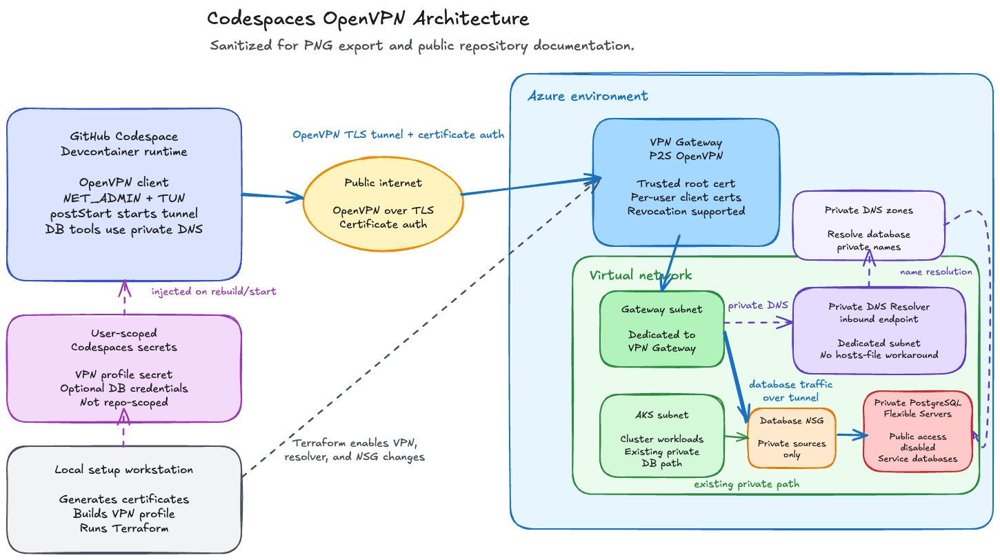

# Dev Codespaces to Azure Private PostgreSQL with OpenVPN P2S

> **Status:** Implemented on `feature/dev-codespaces-openvpn`.

The dev PostgreSQL Flexible Servers are private-only, so GitHub Codespaces cannot
reach them over the public internet. This setup gives a Codespace temporary
private network access by starting an OpenVPN Point-to-Site tunnel into the dev
Azure virtual network.

The guide is intentionally public-safe: keep concrete Azure resource names, IP
addresses, CIDRs, hostnames, generated certificates, VPN profiles, and passwords
out of this file. Use Terraform outputs and local secret files when operating the
environment.

## Architecture



At a high level:

1. The devcontainer includes OpenVPN and starts with `NET_ADMIN` plus
   `/dev/net/tun`.
2. A Codespaces **user** secret provides the per-user OpenVPN profile.
3. The Codespace connects to an Azure VPN Gateway with certificate auth.
4. Optional Azure DNS Private Resolver support lets the Codespace resolve
   private database FQDNs without editing `/etc/hosts`.
5. The database NSG only admits approved private sources: AKS and the VPN client
   pool.

## What Terraform adds

Two feature flags keep the expensive pieces off by default:

| Flag                            | Adds                                                                                                        |
| ------------------------------- | ----------------------------------------------------------------------------------------------------------- |
| `enable_dev_codespaces_openvpn` | Gateway subnet, Standard public IP, Point-to-Site VPN Gateway, and database NSG allow rule for VPN clients. |
| `enable_dns_private_resolver`   | Dedicated resolver subnet, Azure DNS Private Resolver, and inbound endpoint. Requires the VPN flag.         |

The VPN Gateway and DNS resolver are billable and can take a long time to create
or destroy. Enable them only while actively using the tunnel.

## CI/CD decision

Do **not** enable this path in the normal CI/CD pipeline. The OpenVPN gateway is
a developer-access convenience for Codespaces, not a requirement for building,
testing, or deploying the app. The existing CI Terraform job should keep
validating the configuration with the feature flags at their default `false`
values.

If automation is needed later, make it a protected, manual infrastructure
workflow for the dev environment only. It would need a securely stored trusted
root certificate public value, but it still should not generate or distribute
client VPN profiles; those remain per-user secrets.

## Repo files involved

| Path                                                     | Purpose                                                                          |
| -------------------------------------------------------- | -------------------------------------------------------------------------------- |
| `.devcontainer/Dockerfile`                               | Installs OpenVPN and smoke-test tools in the Codespaces image.                   |
| `.devcontainer/devcontainer.json`                        | Grants network capability/TUN access and runs the startup scripts.               |
| `.devcontainer/postcreate/install-dev-tools.sh`          | Writes the VPN profile from the user secret and starts OpenVPN.                  |
| `.devcontainer/postcreate/setup-pgsql-credentials.sh`    | Optionally pre-populates VS Code PostgreSQL extension passwords.                 |
| `infrastructure/terraform/modules/codespaces_vpn/`       | Provisions the P2S VPN Gateway pieces.                                           |
| `infrastructure/terraform/modules/dns_private_resolver/` | Provisions the optional inbound resolver endpoint.                               |
| `scripts/generate-codespaces-vpn-cert.sh`                | Generates the root and client certificates locally.                              |
| `scripts/build-codespaces-openvpn-config.sh`             | Builds the final OpenVPN profile from Azure's generated profile and local certs. |

## Setup

Run the provisioning steps from a trusted workstation, not from the Codespace.

### 1. Generate certificates

```bash
./scripts/generate-codespaces-vpn-cert.sh
```

This creates git-ignored material under `codespaces-vpn-secrets/`. Treat the
client key and profile like SSH private keys.

### 2. Apply Terraform

```bash
cd infrastructure/terraform/environments/dev

export TF_VAR_codespaces_vpn_root_certificate_public_data="$(cat ../../../codespaces-vpn-secrets/azure-vpn-root-public.txt)"
export TF_VAR_enable_dev_codespaces_openvpn=true
export TF_VAR_enable_dns_private_resolver=true

terraform init
terraform plan -out=tfplan
terraform apply tfplan
```

The resolver flag is recommended because it avoids per-Codespace `/etc/hosts`
entries and survives database private endpoint changes.

### 3. Build and store the VPN profile

```bash
cd "$(git rev-parse --show-toplevel)"
./scripts/build-codespaces-openvpn-config.sh > /tmp/vpnconfig.ovpn

gh secret set OPENVPNCONFIG \
  --user \
  --repos "$(gh repo view --json nameWithOwner -q .nameWithOwner)" \
  --body "$(cat /tmp/vpnconfig.ovpn)"
```

Use a Codespaces **user** secret, not a repository secret. The VPN profile embeds
client private key material and must stay user-scoped.

### 4. Optional: pre-populate database passwords

Set `DEV_DB_PASSWORDS_JSON` as another Codespaces user secret if you want the
PostgreSQL VS Code extension to connect without prompting. Its value is a JSON
object mapping the configured database names to their passwords from Key Vault.

Build the JSON straight from Key Vault on the laptop you used for `terraform apply`:

```bash
KV="$(terraform -chdir=infrastructure/terraform/environments/dev output -raw key_vault_name)"
extract_pwd() {
    az keyvault secret show --vault-name "$KV" --name "$1" --query value -o tsv \
        | sed -n 's|.*://[^:]*:\([^@]*\)@.*|\1|p'
}
DEV_DB_PASSWORDS_JSON="$(jq -nc \
    --arg userdb    "$(extract_pwd user-db-connection-string)" \
    --arg productdb "$(extract_pwd product-db-connection-string)" \
    --arg orderdb   "$(extract_pwd order-db-connection-string)" \
    '{userdb:$userdb, productdb:$productdb, orderdb:$orderdb}')"

gh secret set DEV_DB_PASSWORDS_JSON \
    --user \
    --repos "$(gh repo view --json nameWithOwner -q .nameWithOwner)" \
    --body "$DEV_DB_PASSWORDS_JSON"
```

The setup script writes the values to a per-Codespace `.vscode/settings.json`
with restrictive file permissions. It writes both `password` and
`savePassword: true`; on activation, the PostgreSQL extension moves the
password into VS Code SecretStorage and rewrites the settings file with the
plaintext `password` field blank. That blank field is expected;
`savePassword: true` is what makes the extension read the saved SecretStorage
value.

> Rotate the secret whenever the dev DBs are re-created with new random
> passwords — re-run the snippet above and the secret value is replaced.
> Codespaces only re-injects user secrets at container creation, so pick
> up the new value with **Codespaces: Rebuild Container** (a plain
> stop/start keeps the old env var). After the rebuild the new password
> is already filled in when VS Code attaches.

### 5. Rebuild the Codespace and verify

Use **Codespaces: Rebuild Container** or create a fresh Codespace. A restart is
not enough when Dockerfile or `runArgs` changed.

After the rebuild, two lifecycle hooks fire:

`onCreateCommand` runs `setup-pgsql-credentials.sh` once, before VS Code
attaches. When `DEV_DB_PASSWORDS_JSON` is set it materializes a
per-codespace `.vscode/settings.json` (mode `600`, git-ignored) with the
`password` field filled in and `savePassword: true` on each
`pgsql.connections` entry, so the official Microsoft PostgreSQL VS Code
extension saves the populated passwords to SecretStorage on its first
activation — no Reload Window required.

`postStartCommand` then calls two scripts in sequence:

`install-dev-tools.sh`, which brings up the tunnel:

- Verifies `/dev/net/tun` exists in the container (preflight check).
- Writes `OPENVPNCONFIG` to `.ignore/openvpn.config` (mode `600`).
- Launches `openvpn` as a daemon, logs to `.ignore/openvpn.log`, and
  records the PID in `.ignore/openvpn.pid`.
- Polls the log for `Initialization Sequence Completed` for up to 20s.

`setup-pgsql-credentials.sh` runs again as a no-op refresh (idempotent
with respect to `DEV_DB_PASSWORDS_JSON`); this keeps the file in sync on
every start without forcing a rebuild.

Verify in the Codespace terminal:

```bash
sudo ip addr show tun0

USER_DB_FQDN="$(terraform -chdir=infrastructure/terraform/environments/dev output -raw user_db_fqdn)"
POSTGRES_PORT="<postgres-port>"
nslookup "$USER_DB_FQDN"
nc -vz "$USER_DB_FQDN" "$POSTGRES_PORT"
pg_isready -h "$USER_DB_FQDN" -p "$POSTGRES_PORT"
```

With the DNS resolver enabled, private database names should resolve through the
tunnel automatically. If the resolver is disabled, use a temporary `/etc/hosts`
entry only as a fallback; it is wiped on rebuild and should not be the default
path.

### 6. Connect

The devcontainer includes the Microsoft PostgreSQL VS Code extension with dev
database profiles configured. The VPN must be up before those profiles can
connect.

For CLI access, pull the relevant database FQDN from Terraform outputs and the
password from Key Vault. Prefer the DNS resolver flow so the FQDN resolves
natively over the tunnel.

```bash
USER_DB_FQDN="$(terraform -chdir=infrastructure/terraform/environments/dev \
    output -raw user_db_fqdn)"
POSTGRES_PORT="<postgres-port>"
DB_NAME="<database-name>"
DB_USER="<database-admin-user>"
PGPASSWORD="$(az keyvault secret show \
    --vault-name "$(terraform -chdir=infrastructure/terraform/environments/dev output -raw key_vault_name)" \
    --name user-db-connection-string -o tsv --query value | sed -n 's|.*://[^:]*:\([^@]*\)@.*|\1|p')" \
psql "host=$USER_DB_FQDN port=$POSTGRES_PORT dbname=$DB_NAME user=$DB_USER sslmode=require"
```

For VS Code access, open the PostgreSQL activity bar view and use the three
preconfigured dev profiles. When `DEV_DB_PASSWORDS_JSON` is set, one click
connects with no password prompt after the extension saves the generated
profile passwords to SecretStorage.

### 7. Tear down when done

```bash
cd infrastructure/terraform/environments/dev
unset TF_VAR_enable_dev_codespaces_openvpn
unset TF_VAR_enable_dns_private_resolver
terraform apply
```

This removes the gateway, resolver, VPN client NSG rule, and related subnets.
The rest of the dev environment stays intact.

## Security model

- The gateway has a public endpoint by design; certificate authentication is the
  gate.
- Client certificates are bearer credentials. Generate one client cert per user
  and revoke compromised certs in the VPN Gateway configuration.
- Keep VPN material in Codespaces user secrets and git-ignored local folders.
- Do not commit `.ignore/`, `codespaces-vpn-secrets/`, generated VPN profiles,
  OpenVPN logs, or database passwords.
- PostgreSQL remains private-only and still requires TLS plus database
  credentials; the tunnel only provides network reachability.

## Troubleshooting

| Symptom                                                   | Likely cause                                                                             | Fix                                                                                                             |
| --------------------------------------------------------- | ---------------------------------------------------------------------------------------- | --------------------------------------------------------------------------------------------------------------- |
| `/dev/net/tun` is missing                                 | Codespace was restarted instead of rebuilt after `runArgs` changed.                      | Run **Codespaces: Rebuild Container** or create a fresh Codespace.                                              |
| `TUNSETIFF: Operation not permitted`                      | `NET_ADMIN` capability is missing.                                                       | Check `.devcontainer/devcontainer.json` and rebuild.                                                            |
| OpenVPN never reaches `Initialization Sequence Completed` | Gateway still provisioning, profile is stale, or certs do not match the registered root. | Confirm Terraform applied successfully, rebuild the profile, update the user secret, and rebuild the Codespace. |
| Private database name does not resolve                    | DNS resolver disabled or the VPN profile was built before resolver creation.             | Rebuild the VPN profile after applying the resolver, update the user secret, and rebuild the Codespace.         |
| Database TCP probe times out                              | Tunnel is down or the database NSG rule was not applied.                                 | Check `.ignore/openvpn.log`, verify `tun0`, and re-run Terraform if needed.                                     |

Stop the tunnel manually with:

```bash
sudo kill "$(cat .ignore/openvpn.pid)"
```

## Future improvements

- Store and rotate per-user client certs through Key Vault.
- Implement split DNS so only private Azure zones use the resolver while public
  lookups keep using Codespaces default DNS.
