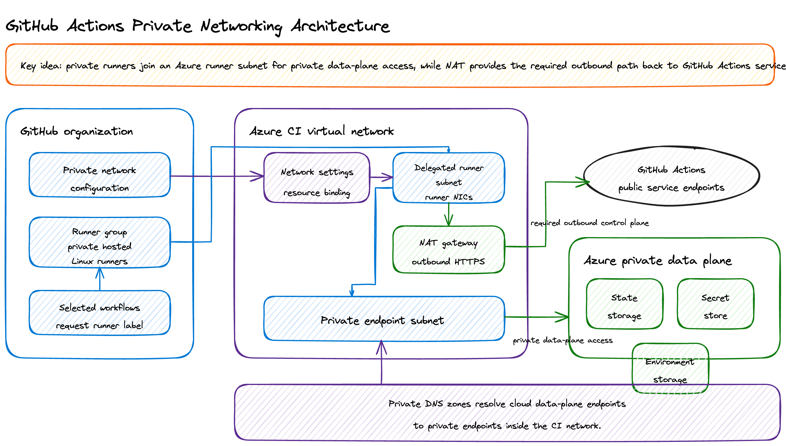
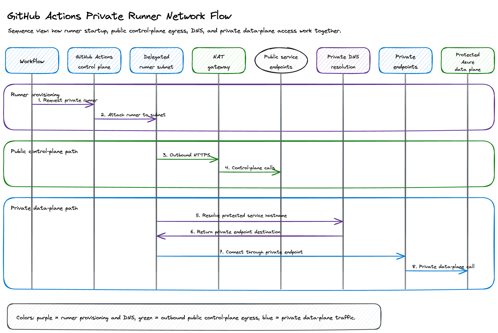

# GitHub Actions private networking

This guide explains why the project uses GitHub-hosted runners attached to an
Azure virtual network, what network resources are created, how traffic flows,
and how to set up the private runner path.



## Why this exists

OIDC and Azure RBAC prove who the workflow is, but they do not provide network
reachability. A normal public GitHub-hosted runner cannot access Azure data-plane
endpoints that are locked down with public network access disabled, even when the
runner has a valid Azure token.

The private networking setup solves that by placing GitHub-hosted runners into a
dedicated Azure virtual network. From there, the runner can reach private
endpoints for protected Azure resources while still using short-lived OIDC
credentials for authorization.

The design keeps two paths separate:

| Path                      | Purpose                                                                     |
| ------------------------- | --------------------------------------------------------------------------- |
| Private data-plane path   | Runner to Azure services through private endpoints and private DNS.         |
| Public control-plane path | Runner to GitHub Actions service endpoints through NAT over outbound HTTPS. |

Both paths are required. Without private endpoints, the runner cannot reach
locked-down Azure data-plane resources. Without NAT or another explicit outbound
route, the private runner can join the virtual network but cannot reliably
connect back to GitHub to start and process jobs.

## What gets deployed

The bootstrap script creates the Azure-side plumbing needed by GitHub hosted
compute networking:

| Resource type                             | Purpose                                                                                              |
| ----------------------------------------- | ---------------------------------------------------------------------------------------------------- |
| Resource group                            | Isolates the CI networking resources from application environments.                                  |
| Virtual network                           | Hosts private runner network integration and private endpoints.                                      |
| Delegated runner subnet                   | Subnet delegated to `GitHub.Network/networkSettings`; GitHub injects runner network interfaces here. |
| Private endpoint subnet                   | Dedicated subnet for private endpoints to protected Azure data-plane services.                       |
| Standard public IP and NAT gateway        | Gives private runners explicit outbound internet access for GitHub Actions service endpoints.        |
| `GitHub.Network/networkSettings` resource | Azure resource that binds the delegated subnet to a GitHub organization or enterprise.               |
| Private DNS zones and VNet links          | Resolves protected service hostnames to private endpoint addresses from inside the CI VNet.          |
| Private endpoints                         | Private data-plane access to Terraform state storage, environment storage, and secret stores.        |

The GitHub-side setup is completed separately in organization or enterprise
settings. GitHub uses the Azure network settings ID emitted by the bootstrap
script to create a hosted compute network configuration, then attaches a larger
runner group to that network configuration.

## Network flow



1. A workflow starts and selects the private runner label when private networking
   is enabled through repository variables.
2. GitHub allocates a hosted runner from the private runner group and attaches it
   to the delegated runner subnet in Azure.
3. The runner still authenticates to Azure with OIDC. No long-lived Azure
   credentials are stored on the runner.
4. Before Terraform runs, the workflow maps protected Azure data-plane hostnames
   to private endpoint records so the runner uses the private path.
5. Terraform and Azure CLI data-plane calls reach storage and secret services
   through private endpoints in the CI virtual network.
6. The runner uses the NAT gateway for outbound HTTPS back to GitHub Actions
   endpoints, marketplace actions, and other public control-plane dependencies.

This is why the runner subnet needs both private endpoint reachability and
explicit outbound internet access.

## Setup

### Prerequisites

- Azure CLI authenticated to the target subscription.
- GitHub CLI authenticated with permissions to read organization or enterprise
  metadata and manage repository variables.
- Permission to register Azure resource providers and create networking
  resources.
- Permission to configure GitHub hosted compute networking and larger runner
  groups at the organization or enterprise level.

For GitHub network configuration API inspection, refresh the GitHub CLI token
with network configuration scopes:

```bash
gh auth refresh -h github.com \
  -s read:network_configurations \
  -s write:network_configurations
```

### 1. Bootstrap the Azure network

Run the bootstrap script from an admin workstation. Use placeholders for
environment-specific names rather than relying on public documentation defaults:

```bash
scripts/bootstrap-github-actions-private-network.sh \
  --subscription <azure-subscription-id> \
  --repo <github-owner>/<repository> \
  --github-scope org \
  --github-owner <github-owner> \
  --location <azure-region> \
  --resource-group <ci-network-resource-group> \
  --vnet-name <ci-virtual-network> \
  --runner-label <private-runner-label>
```

If hosted compute networking is managed at the enterprise level, bind the Azure
network settings resource to the enterprise instead:

```bash
scripts/bootstrap-github-actions-private-network.sh \
  --subscription <azure-subscription-id> \
  --repo <github-owner>/<repository> \
  --github-scope enterprise \
  --github-owner <enterprise-slug> \
  --location <azure-region> \
  --resource-group <ci-network-resource-group> \
  --vnet-name <ci-virtual-network> \
  --runner-label <private-runner-label>
```

If the GitHub CLI cannot resolve the organization or enterprise database ID,
an admin can pass it explicitly:

```bash
scripts/bootstrap-github-actions-private-network.sh \
  --github-scope <org-or-enterprise> \
  --github-owner <github-owner-or-enterprise-slug> \
  --github-database-id <github-database-id>
```

At the end, the script prints the GitHub network ID from the Azure
`GitHub.Network/networkSettings` resource. Save that value for the GitHub hosted
compute network setup.

### 2. Configure GitHub hosted compute networking

An organization or enterprise admin completes the GitHub-side configuration:

1. Open hosted compute networking settings in the organization or enterprise.
2. Create an Azure private network configuration with the GitHub network ID from
   the bootstrap script.
3. Create a Linux larger runner group.
4. Attach the runner group to the Azure private network configuration.
5. Add a Linux larger runner with the label used by the workflows.
6. Allow the repository to use the runner group.
7. For public repositories, restrict the runner group to selected trusted
   workflows only.

### 3. Set repository variables

The bootstrap script can set these when `--runner-label` and `--repo` are
provided. They can also be set manually:

```bash
gh variable set INFRA_RUNNER_LABEL \
  --repo <github-owner>/<repository> \
  --body '<private-runner-label>'

gh variable set INFRA_RUNNER_PRIVATE_NETWORK \
  --repo <github-owner>/<repository> \
  --body 'true'
```

When `INFRA_RUNNER_PRIVATE_NETWORK=true`, Azure-facing workflows run on
`INFRA_RUNNER_LABEL` and do not temporarily open public data-plane access.

## Workflow behavior

The Terraform workflow has two modes.

| Mode                 | Runner                                                 | Network behavior                                                                                            |
| -------------------- | ------------------------------------------------------ | ----------------------------------------------------------------------------------------------------------- |
| Private runner mode  | Private hosted runner label from repository variables. | Uses private endpoints and private DNS for Azure data plane. Public access stays disabled.                  |
| Public fallback mode | Standard public GitHub-hosted runner.                  | Temporarily enables public access with restricted network rules, then restores restrictions during cleanup. |

In private runner mode, the workflow fails fast if it cannot access:

- Terraform state storage through the private endpoint.
- Secret store data plane through the private endpoint.
- Environment storage data plane through the private endpoint.

This preflight catches misconfigured runner groups, DNS links, private endpoints,
or outbound routing before Terraform makes changes.

## Validation

After setup:

1. Run the infrastructure workflow with `action=plan` for a non-production
   environment.
2. Confirm the job starts on the private runner instead of staying queued.
3. Confirm the private data-plane preflight passes.
4. Confirm Terraform plan completes successfully.
5. Repeat for each environment before removing or disabling public-runner
   fallback behavior.

## Troubleshooting

### Runner stays queued or GitHub reports endpoint connectivity problems

Check the runner subnet outbound path. Private hosted runners need outbound HTTPS
to GitHub Actions service endpoints. If the runner subnet disables default
outbound access, attach a NAT gateway or provide an equivalent approved outbound
route.

### Private data-plane preflight fails

Check these items:

- The GitHub runner group is attached to the expected Azure private network
  configuration.
- The Azure network settings resource points at the delegated runner subnet.
- Private DNS zones are linked to the CI virtual network.
- Private endpoints exist for the protected storage and secret resources.
- The workflow can resolve protected service hostnames to private addresses from
  the runner.

### Terraform plan fails because a backing service is stopped

Private networking can be working correctly while a target Azure service is
stopped. Start the affected service and rerun the workflow.
